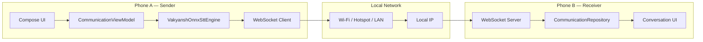
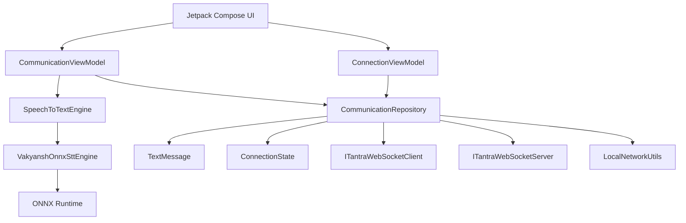
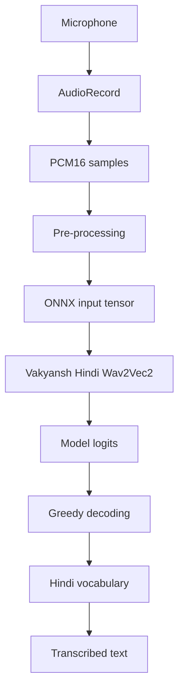
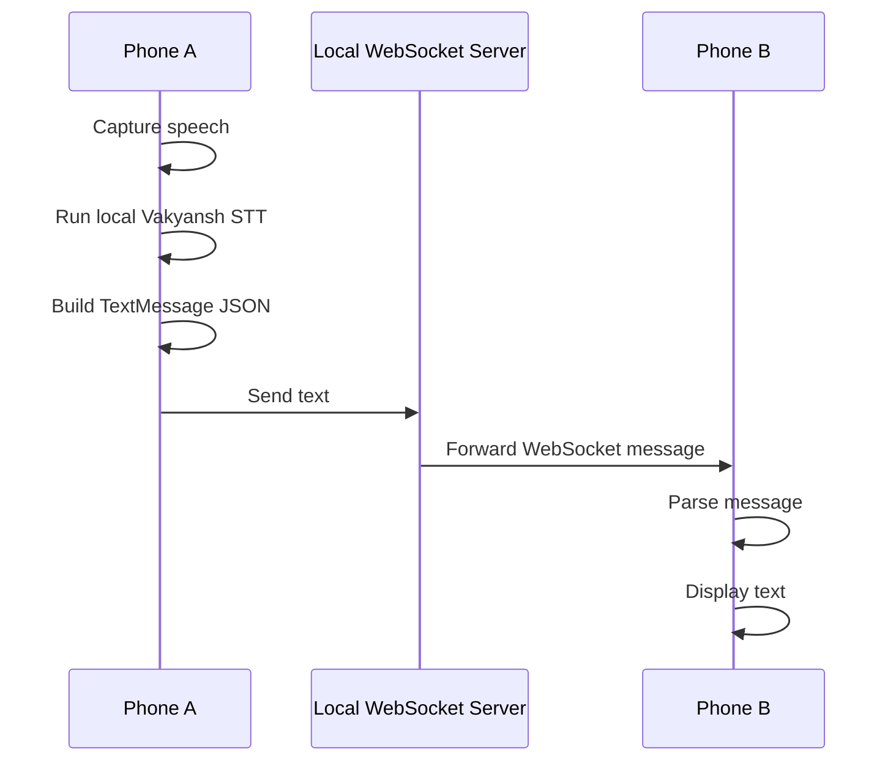

# iTantra — Offline Voice-to-Text Communication POC

[](https://sih.gov.in)
[](https://developer.android.com)
[](https://kotlinlang.org)
[]()
[]()

> **iTantra converts spoken language into text on the device and sends only the text over a local network, reducing the amount of information that must cross a constrained communication link.**

## 🎯 What This POC Actually Demonstrates

This repository contains a working Android proof-of-concept built around:

**Speech → Local STT → Text → Local WebSocket → Text**

The same APK runs on two Android phones.

1. Hold the microphone button and speak.
2. The phone captures **16 kHz mono PCM** using Android `AudioRecord`.
3. **Vakyansh Hindi Wav2Vec2** runs locally through **ONNX Runtime**.
4. The resulting text is serialized as a JSON message.
5. The text is sent over a **local WebSocket connection**.
6. The receiving phone parses the message and displays it.
7. Direct text messaging is also supported.

> **Current scope:** the APK proves local Hindi STT and local text transport. Multilingual STT, offline translation, offline TTS, VAD and constrained-radio transport are future extensions.

## ✅ Current POC Capabilities

| Capability | Status |
|---|:---:|
| Android application | ✅ |
| Same APK on two phones | ✅ |
| Hold-to-talk interaction | ✅ |
| 16 kHz mono PCM capture | ✅ |
| On-device Vakyansh Hindi STT | ✅ |
| ONNX Runtime inference | ✅ |
| Local WebSocket server | ✅ |
| Local WebSocket client | ✅ |
| Text-only communication payload | ✅ |
| Host / Join connection model | ✅ |
| Local IP discovery | ✅ |
| Message serialization | ✅ |
| Conversation history | ✅ |
| Connection status UI | ✅ |
| Direct text messaging | ✅ |
| Offline neural TTS | 🔄 Future |
| Multilingual offline STT | 🔄 Future |
| Offline translation | 🔄 Future |
| VAD | 🔄 Future |
| Payload compression | 🔄 Future |
| Low-bandwidth radio transport | 🔄 Future |
| Mesh networking | 🔄 Future |
| Emergency messaging | 🔄 Future |

---

# 🏗️ Architecture

## End-to-End


## Two-Phone Architecture



## Android Architecture



## Speech Recognition Pipeline



## Local Communication Sequence



---

# 📡 Local Communication

The host phone starts a WebSocket server on port **8765**. The joining phone connects using:

```text
ws://<host-local-ip>:8765
```

The communication layer sends **text messages**, not recorded audio.

Example payload:

```json
{
  "senderId": "7a31c2f1",
  "text": "namaskaram"
}
```

This separation means the speech engine can evolve independently from the transport layer.

---

# 🧠 Why Text Instead of Audio?

Traditional voice communication:

```text
Microphone → Audio Stream → Network → Speaker
```

iTantra POC:

```text
Microphone → Local STT → Text → Network → Text
```

The proof-of-concept therefore moves the speech processing to the endpoints and leaves the communication link responsible for the information itself.

---

# 📱 Application Flow

```text
Setup
  ↓
Connection
  ↓
Communication
```

### Connection

One phone acts as **Host** and starts the local WebSocket server.

The other phone acts as **Join** and connects using the host's local IP address.

### Communication

The communication screen provides:

- connection status
- conversation history
- text input
- send button
- hold-to-talk microphone button
- transcription status

---

# 🗂️ Project Structure

```text
app/src/main/
├── assets/
│   ├── onnx/
│   │   ├── vakyansh_hindi.onnx
│   │   └── vakyansh_hindi.onnx.data
│   └── vakyansh-hindi/
│       └── vocab.json
│
└── java/com/itantara/app/
    ├── MainActivity.kt
    ├── data/
    │   ├── model/
    │   └── repository/
    │       └── CommunicationRepository.kt
    ├── network/
    │   ├── ConnectionState.kt
    │   ├── ITantraWebSocketClient.kt
    │   ├── ITantraWebSocketServer.kt
    │   └── LocalNetworkUtils.kt
    ├── speech/
    │   ├── SpeechToTextEngine.kt
    │   └── VakyanshOnnxSttEngine.kt
    └── presentation/
        ├── setup/
        ├── connection/
        ├── communication/
        ├── navigation/
        └── theme/
```

---

# ⚙️ Technology Stack

| Layer | Technology |
|---|---|
| Platform | Android |
| Language | Kotlin |
| UI | Jetpack Compose + Material 3 |
| State | Kotlin StateFlow |
| Audio capture | Android AudioRecord |
| STT | Vakyansh Hindi Wav2Vec2 |
| ML runtime | ONNX Runtime Android |
| Transport | WebSocket |
| WebSocket library | Java-WebSocket 1.5.6 |
| Network | Local Wi-Fi / hotspot / LAN |
| Serialization | JSON |
| Minimum SDK | 26 |
| Target SDK | 37 |

---

# 🧪 What the POC Proves

### Local STT
The Vakyansh model is packaged into the Android application and loaded locally through ONNX Runtime.

### Text-only transport
The recorded audio is **not** sent to the peer. Only the recognition result is transmitted.

### Same APK, two roles
The same build can act as host or joiner.

### Transport independence
The speech engine and networking layer are separated, allowing the transport to be replaced later without redesigning the speech pipeline.

---

# 🚀 Run the POC

## Requirements

- Android Studio
- JDK 17
- Android SDK
- Two Android phones
- Both phones connected to the same Wi-Fi network or hotspot
- Microphone permission

## Build

Linux/macOS:

```bash
./gradlew assembleDebug
```

Windows:

```powershell
gradlew.bat assembleDebug
```

Application ID:

```text
com.itantara.app
```

## Judge Demo

**Phone A**

1. Install the APK.
2. Open the app.
3. Select **Host**.
4. Start the local server.
5. Note the displayed local IP.

**Phone B**

1. Install the same APK.
2. Select **Join**.
3. Enter Phone A's local IP.
4. Connect.

**Demonstrate**

1. Open Communication on both phones.
2. Hold the microphone button on Phone A.
3. Speak a Hindi sentence.
4. Release.
5. Local Vakyansh STT produces text.
6. The text is sent over the local WebSocket.
7. Phone B displays the received text.

---

# 📥 Download the POC APK

## **[Download iTantra POC APK](https://github.com/theguy1234567/Itantra/blob/main/iTantra-POC.apk)**

The APK is included directly in this repository as `iTantra-POC.apk`.

---

# 🔭 Future Scope

### 1. Multilingual Offline STT
Extend the local STT layer beyond Hindi to the targeted Indian languages.

### 2. Offline Translation
Add an on-device translation layer so messages can be translated without Internet access.

### 3. Offline TTS
Convert received text back into speech locally on the receiving phone.

### 4. Voice Activity Detection
Detect speech boundaries automatically and reduce unnecessary inference.

### 5. Payload Compression
Compress text and add fragmentation, acknowledgement and retransmission for very small links.

### 6. Low-Bandwidth Radio
Add transport adapters for LoRa-class, custom RF, satellite and other constrained links.

### 7. Store-and-Forward Mesh
Allow nearby devices to relay text messages beyond direct range.

### 8. Emergency Priority Messages
Add prioritised alert packets for mission-critical communication.

### 9. Resource Optimisation
Measure and optimise model size, RAM, CPU, inference latency, battery consumption and payload size.

### 10. Full iTantra Transceiver
Combine:
```text
Offline STT
+ Offline Translation
+ Text Compression
+ Low-Bandwidth Transport
+ Offline TTS
+ Emergency Messaging
```
into the complete multilingual neural transceiver envisioned by the project.

---

# 🧱 POC vs. Full System

| Capability | Current POC | Future System |
|---|:---:|:---:|
| Android app | ✅ | ✅ |
| Push-to-talk | ✅ | ✅ |
| **Offline local STT** | ✅ **Hindi / Vakyansh ONNX** | ✅ Multilingual |
| **16 kHz PCM audio capture** | ✅ | ✅ |
| **On-device ONNX inference** | ✅ | ✅ |
| **Local WebSocket server/client** | ✅ | Development transport |
| **Text-only communication** | ✅ | ✅ |
| **Host / Join two-phone flow** | ✅ | ✅ |
| **Local IP discovery** | ✅ | ✅ |
| **Conversation UI / message history** | ✅ | ✅ |
| Offline translation | — | ✅ |
| Offline TTS | — | ✅ |
| VAD | — | ✅ |
| Payload compression | — | ✅ |
| Low-bandwidth radio | — | ✅ |
| Mesh networking | — | ✅ |
| Emergency messaging | — | ✅ |
| **Fully Internet-independent STT + text transport** | ✅ | ✅ Full pipeline |

---

# 📌 Problem–Solution Summary

**Problem:** Conventional voice communication keeps a continuous audio stream in the communication path.

**POC approach:** iTantra performs speech recognition at the endpoint and sends the resulting information as text.

```text
Speech
  ↓
Local STT
  ↓
Text
  ↓
Local Communication Link
  ↓
Text
```

**Long-term direction:** replace the development transport and expand the local model stack so the same architecture can operate across much more constrained communication links.

---

<p align="center">
  <b>iTantra</b><br>
  <i>Voice transformed into information that can travel beyond the network.</i>
</p>